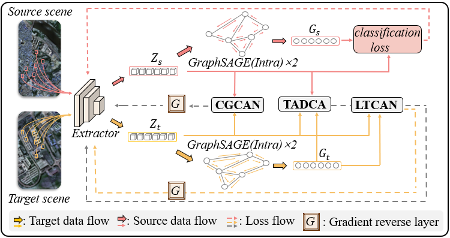
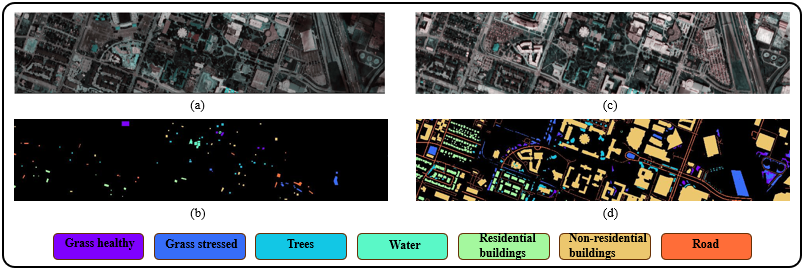
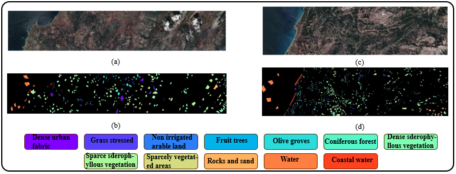
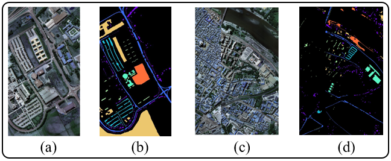

# Joint Adversarial Network With Semantic and Topology Fusion for Cross-Scene Hyperspectral Image Classification
Implementation of papers:
- [Joint Adversarial Network With Semantic and Topology Fusion for Cross-Scene Hyperspectral Image Classification](https://ieeexplore.ieee.org/abstract/document/10559841)  
  IEEE Transactions on Geoscience and Remote Sensing (IEEE TGRS), 2024.  
  Ronghua Shang, Yuhao Xie, Weitong Zhang, Jie Feng, Songhua Xu

<div align=center>
	
	<p>Framwork of JAN-STF. (Details of CGCAN, TADCA and LTCAN can be found in paper). </p>
</div>

## Environment
Ubuntu 20.04.2 LTS, python 3.8.10, PyTorch 1.12.1.

## Datasets
Application website： [Houston, HyRANK, Pavia](https://github.com/YuxiangZhang-BIT/Data-CSHSI)
<div align="center">
  
  <p>(a),(b): False color and GT maps of Houston2013. (c), (d): False color and GT maps of Houston2018. </p>
</div>
<div align="center">
  
  <p>(a),(b): False color and GT maps of Dioni. (c), (d): False color and GT maps of Loukia. </p>
</div>
<div align="center">
  
  <p>(a),(b): False color and GT maps of PaviaU. (c), (d): False color and GT maps of PaviaC. </p>
</div>

## Usage
```bash
cd code
python train.py
```

## Citation
If you find our paper or code helpful, please cite our work.
```bash
@ARTICLE{10559841,
  author={Shang, Ronghua and Xie, Yuhao and Zhang, Weitong and Feng, Jie and Xu, Songhua},
  journal={IEEE Transactions on Geoscience and Remote Sensing}, 
  title={Joint Adversarial Network With Semantic and Topology Fusion for Cross-Scene Hyperspectral Image Classification}, 
  year={2024},
  volume={62},
  number={},
  pages={1-16},
  keywords={Semantics;Adversarial machine learning;Feature extraction;Hyperspectral imaging;Measurement;Training;Task analysis;Adversarial learning;domain adaptation;hyperspectral image (HSI);semantic attention;topological structure},
  doi={10.1109/TGRS.2024.3415965}}
```

## Contributors
For any questions, feel free to open an issue or contact us:
- <a href="mailto:yaoxie1001@gmail.com">yaoxie1001@gmail.com</a>
